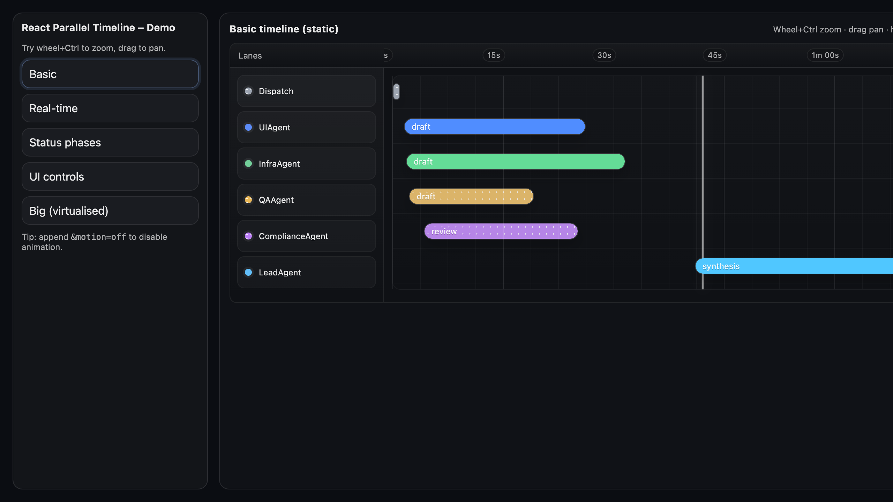
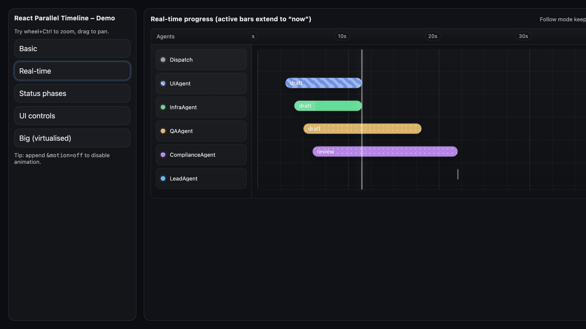
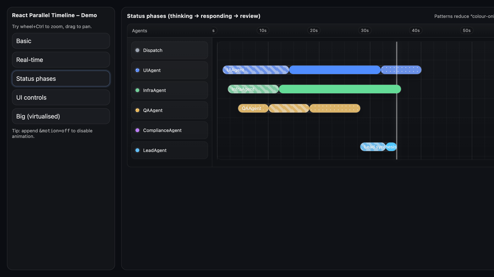
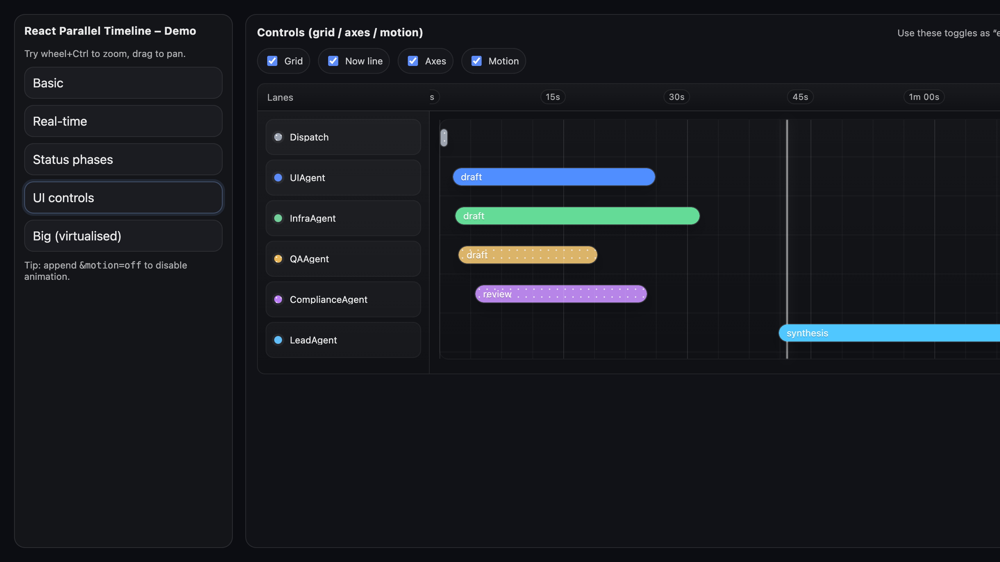
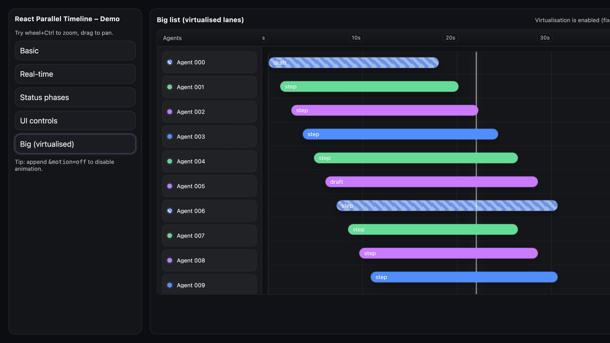

# React Parallel Timeline (React 19 + TypeScript 5) – Starter

An extensible, Gantt-style timeline component, with:
- Real-time progress (active bars extend to `now`)
- Parallel lanes (agents/processes listed on the left)
- Flexible coloring (by lane, item, or status)
- Status transitions (e.g. thinking → responding) via segmented bars with subtle patterns
- Configurable motion (`motion.mode: 'on' | 'off' | 'auto'`)
- Optional UI elements: time axis, lane axis, grid, now line, hover line
- Zoom + pan (modifier-wheel zoom, drag to pan)
- Optional lane virtualisation for large lists (fixed row-height mode)
- Accessible defaults (keyboard focus, ARIA labels, reduced-motion support)
- Dual builds (ESM + CommonJS), Node 18+

## Demo videos

The MP4s below are generated by `npm run e2e` and stored in `docs/videos/`.

### Basic
[](docs/videos/basic.mp4)
https://raw.githubusercontent.com/emmett08/react-parallel-timeline-starter/main/docs/videos/basic.mp4

### Realtime
[](docs/videos/realtime.mp4)
https://raw.githubusercontent.com/emmett08/react-parallel-timeline-starter/main/docs/videos/realtime.mp4

### Phases
[](docs/videos/phases.mp4)
https://raw.githubusercontent.com/emmett08/react-parallel-timeline-starter/main/docs/videos/phases.mp4

### Controls
[](docs/videos/controls.mp4)
https://raw.githubusercontent.com/emmett08/react-parallel-timeline-starter/main/docs/videos/controls.mp4

### Big
[](docs/videos/big.mp4)
https://raw.githubusercontent.com/emmett08/react-parallel-timeline-starter/main/docs/videos/big.mp4

## Quick start

```bash
npm i
npm run build
npm run dev
```

Open the demo:
- `http://localhost:5173/?demo=basic`
- `http://localhost:5173/?demo=realtime`
- `http://localhost:5173/?demo=phases`
- `http://localhost:5173/?demo=controls`
- `http://localhost:5173/?demo=big`

## Library usage

```tsx
import { Timeline } from "@neuralsea/react-parallel-timeline";
import "@neuralsea/react-parallel-timeline/styles.css";

export function Example() {
  return (
    <Timeline
      lanes={[{ id: "ui", label: "UIAgent", color: "#4C8DFF" }]}
      items={[
        { id: "a", laneId: "ui", start: 0, end: 10_000, label: "draft", status: "responding" }
      ]}
      defaultView={{ start: 0, end: 60_000 }}
      now={12_345}
      grid={{ show: true }}
      axes={{ showLaneAxis: true, showTimeAxis: true, timeOrigin: 0 }}
      motion={{ mode: "auto" }}
    />
  );
}
```

## Custom styling

Override CSS variables on a wrapper:

```css
.myTheme {
  --rt-bg: #0b1220;
  --rt-panel: #0f1a2f;
  --rt-text: #e7eefc;
  --rt-grid: rgba(255,255,255,.08);
  --rt-now: rgba(255,255,255,.5);
}
```

Or pass classes via `classNames` / `getItemClassName` and implement your own CSS.
